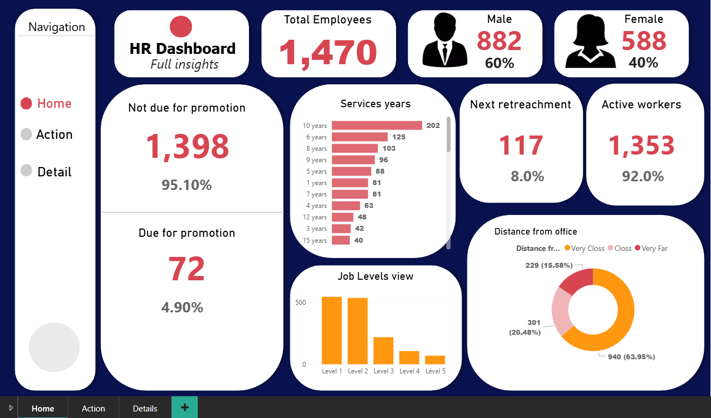
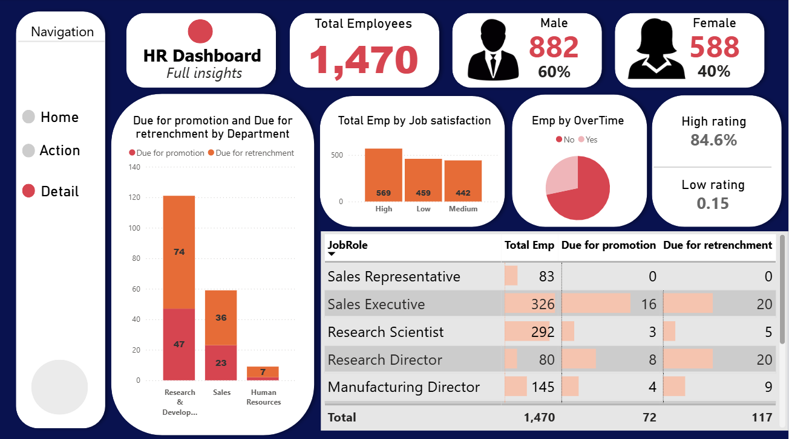
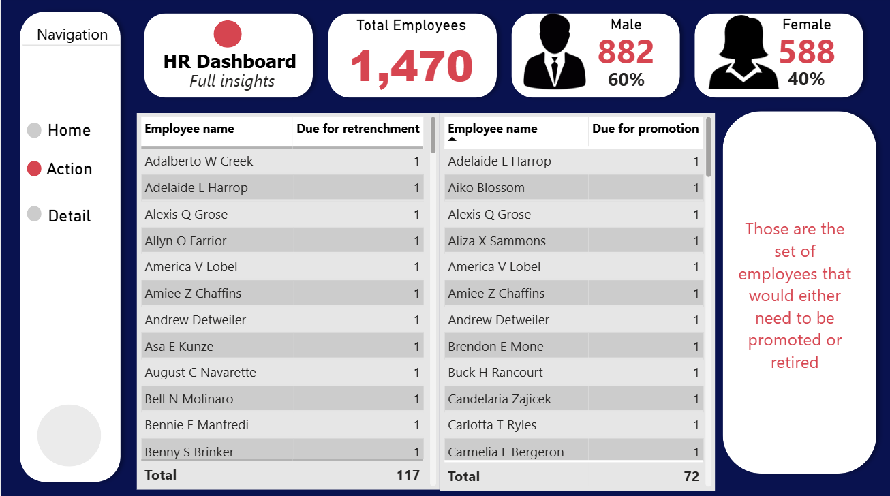

# HR-Dashboard-Workforce-Performance-Retention-Insights
An interactive HR analytics dashboard that analyzes employee demographics, job satisfaction, promotion eligibility, retrenchment risk, service years, overtime patterns, and workforce distribution. The project transforms HR data into actionable insights to support workforce planning, performance management, and retention strategies.
# Introduction
Human Resource data plays a critical role in understanding workforce performance, employee satisfaction, retention risks, and organizational growth. However, raw HR data often lacks clarity when not properly analyzed and visualized.
This project presents an HR Analytics Dashboard designed to provide clear, actionable insights into employee demographics, job satisfaction, promotion readiness, retrenchment risk, workforce distribution, and operational factors such as overtime and distance from office. The dashboard supports data-driven HR decision-making and strategic workforce planning.
## Project Objectives
The key objectives of this project are to:
1.	Analyze overall workforce composition and demographics.
2.	Identify employees due for promotion and those at retrenchment risk.
3.	Assess job satisfaction levels across the organization.
4.	Evaluate employee engagement through overtime analysis.
5.	Understand workforce distribution by job role, job level, and service years.
6.	Support HR planning, retention strategies, and performance management.
### Dataset Overview
The dataset used in this project contains employee-level HR data, including:
- Employee demographics (Gender, Distance from office)
- Job roles and job levels
- Job satisfaction ratings
- Years of service
- Promotion eligibility status
- Retrenchment indicators
- Overtime status
- Employment status (Active employees)
### The dataset was cleaned and modeled to ensure accuracy and consistency for analysis.
## Tools & Technologies
- Power BI – Data modeling, visualization, and dashboard development
- Microsoft Excel – Data cleaning and preprocessing
- DAX – Measures and calculated metrics
- GitHub – Documentation and project hosting
## Dashboard Overview

[Interact with the live Dashboard here](https://app.powerbi.com/groups/me/reports/79406820-00d0-4a3e-b848-4c5c49c88dc3/ReportSection?experience=power-bi)

[Interact with the live Dashboard here](https://app.powerbi.com/groups/me/reports/79406820-00d0-4a3e-b848-4c5c49c88dc3/ReportSection3011d8db0a27e00c8138?experience=power-bi)

[Interact with the live Dashboard here](https://app.powerbi.com/groups/me/reports/79406820-00d0-4a3e-b848-4c5c49c88dc3/ReportSection54e809550830c37d2989?experience=power-bi)
The dashboard is organized into multiple sections to provide a comprehensive HR overview:
### Key Workforce KPIs
- Total Employees: 1,470
- Male Employees: 882 (60%)
- Female Employees: 588 (40%)
- Active Workers: 1,353 (92%)
- Employees Due for Promotion: 72 (4.9%)
- Employees Due for Retrenchment: 117 (8.0%)
### These KPIs provide an instant snapshot of workforce health and structure.
## Key Insights & Analysis
1️. Workforce Demographics
- The workforce is male-dominated (60%), with females representing 40%.
- A high percentage of employees (92%) are active workers, indicating workforce stability.
## Insight: Gender diversity initiatives could be explored to achieve better workforce balance.
2️. Promotion & Retrenchment Analysis
- Only 4.9% of employees are currently due for promotion.
- 8.0% of employees are flagged for potential retrenchment.
- Research & Development and Sales departments show higher promotion and retrenchment activity.
## Insight: Promotion planning and performance reviews can be optimized to improve motivation and reduce attrition risk.
3️.  Job Satisfaction Distribution
- The majority of employees fall within high and medium satisfaction levels.
- A smaller proportion of employees report low satisfaction.
## Insight: Low-satisfaction employees represent a retention risk and should be prioritized for engagement strategies.
4️. Service Years Analysis
- Most employees have 6–10 years of service, indicating a moderately experienced workforce.
- Fewer employees fall within very long tenure brackets (12+ years).
## Insight: Career progression and development programs are important to retain mid-tenure employees.
5️. Overtime & Engagement
- A significant portion of employees work overtime.
- Overtime patterns vary across job roles and levels.
## Insight: Sustained overtime may signal high workload and potential burnout risks.
6️. Job Roles & Levels
- Sales Executives and Research Scientists represent some of the largest job role groups.
- Lower job levels (Level 1 and Level 2) dominate the workforce, with fewer employees at senior levels.
## Insight: Clear career progression frameworks can support talent development and leadership pipelines.
7️. Distance from Office
- 63.95% of employees live very close to the office, while others commute from farther distances.
## Insight: Distance from office may influence attendance, engagement, and overtime willingness.
# Business Impact
This HR Dashboard enables organizations to:
- Improve workforce planning and succession management
- Identify promotion and retrenchment risks early
- Enhance employee engagement and retention strategies
- Monitor workforce performance and satisfaction
- Support strategic HR and management decisions
## Recommendations
1.	Strengthen Promotion Planning
Implement structured performance reviews to increase promotion transparency.
2.	Address Retrenchment Risks Early
Utilize engagement programs and skill development to reduce the probability of retrenchment.
3.	Monitor Overtime Trends
Balance workloads to prevent burnout and productivity decline.
4.	Improve Employee Engagement
Focus on low job satisfaction groups with targeted HR initiatives.
5.	Develop Career Pathways
Encourage progression from lower to higher job levels through training and mentorship.
## Conclusion
The HR Analytics Dashboard provides a comprehensive view of workforce dynamics by combining employee demographics, performance indicators, and operational metrics. By transforming HR data into actionable insights, the dashboard enables smarter HR decisions, enhances employee engagement, and fosters sustainable organizational growth.
## About the Author
Folagbade Olatunbosun Samuel
Data Analyst | Business Analyst
- Skilled in data visualization, analytics, and dashboard development
- Tools: Power BI, Excel, SQL
- Passionate about data-driven decision-making
- 💼 LinkedIn:https://www.linkedin.com/in/olatunbosun-folagbade-559151243/
- 📧 Email:Folagbadeolatunbosun@gmail.com

